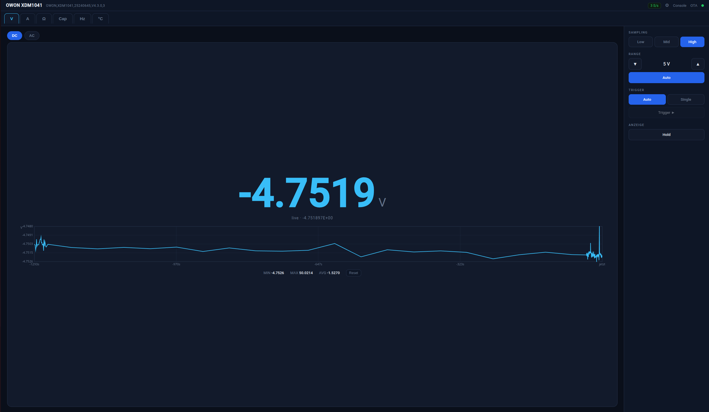

# OWON XDM1041 Remote Bench 🌡️🔌

WLAN-Fernbedienung & Web-Oberfläche für das **OWON XDM1041** Tischmultimeter auf Basis eines **ESP32-WROOM** – mit professionellem Browser-Dashboard, Live-Graph, OTA-Updates, Web-Konsole und **brick-sicherer Selbstheilung**.

> **Abgeleitetes Werk (Fork/Derivative) von [Elektroarzt/owon-xdm-remote](https://github.com/Elektroarzt/owon-xdm-remote) – lizenziert unter GPLv3.**
> Das Original (ESP32-C3 + MQTT) war die Basis: `wifi_manager.py` stammt von dort (Igor Ferreira, mod. Elektroarzt), die SCPI-Startsequenz ebenfalls. Diese Variante läuft auf einem klassischen **ESP32-WROOM**, **ohne MQTT/Home Assistant** – stattdessen eine eigenständige Web-App, OTA, Watchdog/Rollback und ein PyVISA-SCPI-Server. Details in [`NOTICE`](NOTICE).

<!--  -->
> 📷 _Screenshot:_ `docs/screenshot.png` einfügen (Dashboard mit Tabs, Live-Wert, Graph & seitlicher Toolbar).

---

## ✨ Features

- **Volles Browser-Dashboard** – nutzt das ganze Fenster, dunkles Instrument-Design, responsiv (eigenes Handy-Layout).
- **Alle Messmodi** als Tabs: **V** (DC/AC), **A** (DC/AC), **Ω** (Widerstand/Durchgang/Diode), **Kapazität**, **Frequenz**, **Temperatur**.
- **Seitliche Toolbar**: Sampling-Rate (Low/Mid/High), Range (Auto / manuell ▲▼), Trigger (Auto/Single), Hold.
- **Live-Graph mit Achsen** (Werte- & Zeitachse), **Min/Max/Avg**, und eine **„FPS"-Anzeige** der echten Messrate (Samples/s).
- **Auto-Einheiten** (mV/V/kV, µA/mA/A, Ω/kΩ/MΩ, pF/nF/µF, Hz/kHz/MHz, °C) + **„OL"** bei Überlauf.
- **Einstellungen** im Browser: **3 Themes** (Midnight/Carbon/Hell) + frei anpassbare Farben mit **Export/Import**, **Netzwerk** (Hostname, DHCP/feste IP), **System-Info**.
- **OTA-Updates** über WLAN – funktioniert in **allen** Zuständen (Normalbetrieb, Recovery, Setup-AP).
- **Web-Konsole** (`/console`) – Live-Log im Browser, inkl. Absturz-Traceback. Kein USB zum Debuggen nötig.
- **Brick-sicher**: Watchdog + Boot-Zähler + **automatischer Rollback** auf die letzte funktionierende Version.
- **mDNS**: erreichbar unter **`http://owon.local/`** – keine IP-Sucherei.
- **Captive-Portal** zum WLAN-Einrichten, mit Passwort-Bestätigung, „Passwort anzeigen" und SSID-Refresh; leitet nach dem Setup automatisch auf `owon.local` weiter.

---

## 🔌 Hardware & Verkabelung

| Teil | Wert |
|---|---|
| MCU | ESP32-WROOM-32 (ESP32-D0WD-V3, 4 MB Flash) |
| Multimeter | OWON XDM1041 |
| Firmware | MicroPython 1.28.0 (ESP32_GENERIC) |

Die originale interne UART/USB-Platine im OWON abziehen, den ESP an denselben Stecker (J3). **Über Kreuz** verdrahten, **3,3 V Logik – kein Pegelwandler nötig**:

| OWON (J1) | → | ESP32-WROOM |
|---|---|---|
| **TXD** (OWON sendet) | → | **GPIO16** (ESP RX) |
| **RxD** (OWON empfängt) | → | **GPIO17** (ESP TX) |
| **V_IN** (5 V) | → | **VIN / 5V** |
| **GND** | → | **GND** |

> ⚠️ **Nicht** gleichzeitig OWON-5V (V_IN) **und** ESP-USB einspeisen (keine Schutzdiode). Zum Flashen via USB die V_IN-Leitung abziehen. Im Betrieb: nur OWON-5V.

---

## ⚡ Schnellstart

Alles läuft über das interaktive Helfer-Skript **`flash.sh`**:

```bash
./flash.sh
```

```
=============================================
   OWON XDM1041 Remote – Flasher
=============================================
  1) Erstflash per USB  (MicroPython + alles)
  2) OTA-Update         (Netzwerk, auch Recovery)
  3) ESP im Netzwerk suchen
  4) Beenden
```

### 1. Erstinbetriebnahme (per USB)
1. ESP per USB anschließen (OWON-5V/V_IN abziehen).
2. `./flash.sh` → **1) Erstflash per USB**.
   - Installiert bei Bedarf `esptool`/`mpremote`, flasht MicroPython und lädt alle Firmware-Dateien hoch (inkl. Rollback-Basis `app_good.py`).
3. Danach: am Handy/PC ins offene WLAN **`OWON-XDM-Remote-Setup`**, **`http://192.168.4.1`** öffnen → dein WLAN eintragen.
4. Die Seite leitet automatisch weiter auf **`http://owon.local/`**. Fertig. 🎉

### 2. Updates (per OTA, ohne USB)
1. `./flash.sh` → **2) OTA-Update**.
   - Findet **alle** ESPs im Netz (mDNS + Subnetz-Scan) – **auch im Recovery-/AP-Modus** nach einem abgebrochenen Update.
   - Bei **mehreren Geräten** erscheint eine **Auswahl-Liste** (IP, Modus, Hostname, Seriennummer), damit du das richtige erwischst.
2. Dateien auswählen (alle / nur `app.py` / einzeln) → Upload → Neustart.

---

## 🖥️ Bedienung

Browser auf **`http://owon.local/`** (bzw. deinen Hostnamen). 

- **Tabs oben**: Messfunktion wählen, darunter die Untermodi.
- **Toolbar rechts**: Sampling, Range, Trigger, Hold.
- **Zahnrad** (oben rechts): Einstellungen (Design, Netzwerk, System).
- **Log** / **OTA**: Web-Konsole bzw. Update-Seite.

---

## 🌐 Hostname / mDNS

- Standard: **`owon.local`**. Änderbar unter **Einstellungen → Netzwerk → Hostname** → **„Speichern & Neustart"** (gilt erst nach Reboot). Die Seite leitet automatisch auf den neuen Namen weiter.
- Das **`.local`** ist fix (mDNS). `owon.me`/`.com` o. ä. sind nicht möglich.
- Alternativ feste IP einstellbar (sonst DHCP). Im Zweifel ist das Gerät immer über seine IP erreichbar.

---

## 🛡️ Ausfallsicherheit (brick-sicher)

Ein kaputtes Update – Crash, Syntaxfehler **oder Totalhänger** – repariert sich **selbst, ohne USB** (Prinzip wie A/B beim Handy):

1. **Watchdog** (früh in `main.py` scharf, in allen Schleifen gefüttert): Hänger → Reset.
2. **Boot-Zähler** zählt Fehlstarts.
3. **Self-Confirm**: nach ~14 s stabilem Lauf sichert die App den **kompletten App-Satz** als bekannt-guten Snapshot nach **`good/`** und nullt die Zähler.
4. **Voll-Set Auto-Rollback**: nach 4 Fehlboots stellt `main.py` den **ganzen `good/`-Satz** wieder her und **bootet automatisch zurück in die reparierte App** (Schleifen-Schutz: nach 2 erfolglosen Versuchen → Recovery).

> **Trust-Root** sind nur `main.py` + `wd.py` (winzig, stabil) – die werden **per USB** aktualisiert (wie ein Bootloader). Alles andere ist via `good/` selbstheilend.
> Getestet: kaputtes `ota.py` (legt App **und** Recovery lahm) per OTA → in ~35 s vollautomatisch zurück in die normale App, ohne USB. ✅
>
> Zum USB-Debuggen den Watchdog deaktivieren: Datei `nowdt` auf dem ESP anlegen, danach löschen.

---

## 🔧 HTTP-API

| Route | Zweck |
|---|---|
| `GET /api/reading` | aktueller Messwert `{ok,value,raw,age,sps}` |
| `GET /api/status` | voller Zustand (Funktion, Rate, Range, IDN …) |
| `GET /api/function?set=VDC\|VAC\|ADC\|AAC\|RES\|CONT\|DIOD\|CAP\|FREQ\|TEMP` | Funktion wählen |
| `GET /api/rate?set=S\|M\|F` | Sampling Low/Mid/High |
| `GET /api/range?set=auto\|up\|down` | Messbereich |
| `GET /api/net` · `?host=&dhcp=&ip=&mask=&gw=&dns=` | Netzwerk lesen/setzen |
| `GET /api/scpi?cmd=...` | beliebiges SCPI (Debug) |
| `POST /upload?name=X` · `GET /ota` · `POST /reboot` | OTA |
| `GET /console` · `GET /log` · `POST /logclear` | Web-Konsole |

---

## 🧪 PyVISA / SCPI über Netzwerk (Port 5025)

Der ESP stellt **parallel zur Web-Oberfläche** einen rohen SCPI-TCP-Server bereit – dein OWON wird damit zum **netzwerkfähigen Messgerät** für PyVISA/LabVIEW/Python-Scripts.

Installation (PC, reines Python-Backend, kein NI-VISA nötig):
```bash
python3 -m pip install --user --break-system-packages pyvisa pyvisa-py
```
Benutzung:
```python
import pyvisa
rm = pyvisa.ResourceManager('@py')
inst = rm.open_resource('TCPIP::owon1.local::5025::SOCKET')
inst.read_termination = '\n'; inst.write_termination = '\n'; inst.timeout = 3000
print(inst.query('*IDN?'))      # OWON,XDM1041,...
print(inst.query('MEAS?'))      # aktueller Wert
inst.write('CONF:VOLT:AC')      # Funktion umstellen
```
Web-UI und PyVISA laufen **gleichzeitig** (beide gehen über den einen Poller ans Meter, per Lock serialisiert). Zeilenprotokoll: `<cmd>\n`; endet der Befehl auf `?` → Antwort, sonst Write.

## 📟 SCPI-Referenz (XDM1041, verifiziert)

| Zweck | Befehl |
|---|---|
| Messwert | `MEAS?` (≈3–5/s; `1E+9` = Overload) |
| Funktion | `CONF:VOLT:DC` · `CONF:VOLT:AC` · `CONF:CURR:DC` · `CONF:CURR:AC` · `CONF:RES` · `CONF:CONT` · `CONF:DIOD` · `CONF:CAP` · `CONF:FREQ` · `CONF:TEMP` |
| aktive Funktion | `FUNC?` |
| Sampling | `RATE S\|M\|F` · `RATE?` |
| Range | `RANGE 1..6` (manuell) · `AUTO 1` (Autorange) · `RANGE?` · `AUTO?` |

> Hinweis: `VAL1?`/`FETC?` werden nicht unterstützt. Es gibt **kein** SCPI zum Aus-/Neustarten des OWON.

---

## 🗂️ Projektstruktur

```
.
├── flash.sh              # Interaktiver Flasher (USB-Erstflash + OTA)
├── pyvisa_test.py        # PyVISA-Testscript (SCPI über Port 5025)
├── README.md
├── CLAUDE.md             # Ausführliche Entwickler-/Projektnotizen
├── LICENSE               # GPLv3
├── NOTICE                # Credits / übernommen vs. neu
└── firmware/             # MicroPython-Quellcode (= das, was auf den ESP kommt)
    ├── main.py           # Launcher: Watchdog-Arm, Boot-Zähler, Auto-Rollback
    ├── app.py            # Web-App: UI, /api, Poller, Themes, Netzwerk
    ├── wifi_manager.py   # WLAN-Setup (Captive Portal) + OTA im AP-Modus
    ├── ota.py            # OTA-Upload (Streaming) + Web-Konsole
    ├── recovery.py       # Notfall-Server (WLAN + OTA + Konsole)
    ├── dbg.py            # Logging (seriell + RAM-Ring für /console)
    └── wd.py             # Hardware-Watchdog (gemeinsam)
```

---

## ⚠️ Hinweise

- Messrate ist hardwareseitig auf **~3–5 Messungen/s** begrenzt (OWON Fast-Mode).
- Bei großen Uploads `curl` immer mit `-H "Expect:"` aufrufen (macht `flash.sh` automatisch).
- Feste IP nur außerhalb des DHCP-Bereichs wählen.

---

## 📜 Credits & Lizenz

Dieses Projekt ist ein **abgeleitetes Werk** von **[Elektroarzt/owon-xdm-remote](https://github.com/Elektroarzt/owon-xdm-remote)** und steht daher – wie das Original – unter der **GNU General Public License v3 (GPLv3)**, siehe [`LICENSE`](LICENSE).

- **Original & Basis:** Elektroarzt/owon-xdm-remote (Hardware-Konzept, `wifi_manager.py`, SCPI-Startsequenz).
- `wifi_manager.py`: WiFiManager von **Igor Ferreira** (MIT), modifiziert von Elektroarzt und hier weiter angepasst.
- **Neu in dieser Variante:** ESP32-WROOM-Port, komplette Web-App/REST-API, OTA + Recovery + Watchdog + Voll-Set-Rollback, PyVISA-SCPI-Server, `flash.sh`, `pyvisa_test.py`.

Genaue Aufschlüsselung „übernommen vs. neu" in [`NOTICE`](NOTICE). Bei Weitergabe/Veröffentlichung: GPLv3 einhalten (Quelloffen + Namensnennung).
